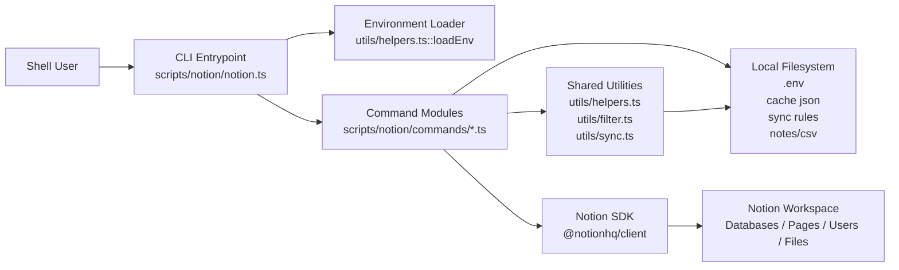

# Architecture Doc: Notion CLI

**Last Updated**: 2026-03-14

**Status**: Draft

**Owners**: Kevin Lin / notion-agent-skill maintainers

**Related**:

- `scripts/notion/AGENTS.md`
- `scripts/notion/USAGE.md`
- `scripts/notion/docs/specs/active/2026-01-31-notion-sync-command.md`
- `scripts/notion/docs/specs/active/2026-02-01-notion-sync-integration-tests.md`

* * *

## 0. Context

### Purpose

The Notion CLI is a local, single-process command-line tool for reading from and writing to a Notion workspace.
It packages common workspace operations into subcommands for page creation, database discovery, search, fetch, metadata caching, block parsing, and file-to-Notion sync.

This CLI exists to make Notion operations scriptable from Kevin's local workflows and markdown/CSV-based tooling without adding a long-running service, server-side state, or a custom API layer.

* * *

## 1. Scope

### In Scope

- Parse CLI arguments and dispatch subcommands through a single entrypoint.
- Load Notion credentials from local environment files.
- Translate local strings, markdown, frontmatter, and CSV rows into Notion API payloads.
- Read and write local sync state such as metadata caches, sync rules, and source-file sync markers.
- Call the official Notion API through the JavaScript SDK.

### Out of Scope

- Running as a persistent daemon, job worker, or hosted API service.
- Managing Notion authentication flows beyond consuming a pre-provisioned integration token.
- Real-time sync, conflict resolution across concurrent writers, or background reconciliation.
- Rich markdown-to-Notion block fidelity beyond the currently implemented block transforms.
- Multi-user tenancy, access control, or centralized secrets management.

* * *

## 2. System Boundaries and External Dependencies

### Boundary Definition

The CLI owns local command orchestration, argument validation, filesystem reads/writes, lightweight schema and rule interpretation, and direct invocation of Notion SDK operations.
It does not own durable business data beyond local cache and sync marker files; Notion remains the authoritative remote store for pages, databases, and uploaded files.

### External Systems

| Dependency | Purpose | Failure Impact |
| --- | --- | --- |
| Notion API via `@notionhq/client` | Remote source of truth for databases, pages, users, search, and uploads | All commands that touch Notion fail or return partial results |
| Local env files (`kevin-garden/.env`, `$HOME/.env`, test variants) | Provide `NOTION_TOKEN` / `NOTION_API_KEY` | CLI cannot authenticate |
| Local home cache (`~/.notion-cache.{env}.json`) | Speeds database-name resolution and stores metadata snapshots | `fetch --database-name` may need live API lookup or fail on stale/ambiguous state |
| Local sync rules (`~/.notion-agents-skill/syncRules/*.yaml`) | Define markdown and CSV sync mappings | `sync` cannot route source files into destination databases |
| Local workspace files (`notes/*.md`, CSV exports, processor scripts) | Source content and persisted sync markers | `sync`, `parse-block`, and file-based create/update flows fail or write incomplete state |
| `yargs` | Command registration, parsing, validation, help/version handling | CLI cannot parse commands consistently |

* * *

## 3. Architecture Overview

### High-Level Diagram (Required)

### Component Responsibilities

| Component | Responsibility | Key Interface |
| --- | --- | --- |
| `scripts/notion/notion.ts` | Bootstraps env loading, registers commands, and configures global CLI behavior | `yargs(...).command(...).parse()` |
| `scripts/notion/commands/create.ts` | Create a page in a database after coercing property values to Notion schema types | `create`, `createPage()` |
| `scripts/notion/commands/list-db.ts` | Enumerate accessible databases using Notion search | `list-db`, `listDatabases()` |
| `scripts/notion/commands/fetch.ts` | Resolve target database, query rows, simplify property values, and optionally render markdown | `fetch`, `resolveDatabaseId()` |
| `scripts/notion/commands/lookup.ts` | Search pages/databases through the Notion Search API with filter and sort normalization | `lookup`, `lookup()` |
| `scripts/notion/commands/sync-meta.ts` | Snapshot database schemas into a local cache file | `sync-meta`, `syncDatabaseMetadata()` |
| `scripts/notion/commands/sync.ts` | Drive markdown/CSV sync, rule loading, payload generation, body replacement, uploads, and source-file persistence | `sync`, `syncRecord()`, `syncMarkdownFile()`, `syncCsvFile()` |
| `scripts/notion/commands/parse-block.ts` | Parse markdown from stdin into `{ title, properties, body }` JSON | `parse-block`, `parseBlock()` |
| `scripts/notion/commands/status.ts` | Verify connectivity by listing users from the workspace | `status`, `listUsers()` |
| `scripts/notion/utils/helpers.ts` | Shared env loading, property coercion, markdown parsing, ID normalization, and file collection | `loadEnv()`, `coerceValueForPropertyType()`, `markdownToParagraphBlocks()` |
| `scripts/notion/utils/filter.ts` | Parse the custom filter language used by `fetch` into Notion query structures | `tokenize()`, `FilterParser`, `parseFilter()` |
| `scripts/notion/utils/sync.ts` | Parse/serialize frontmatter and CSV, match filename triggers, derive sync metadata, and collect source files | `parseFrontmatter()`, `serializeFrontmatter()`, `collectMarkdownFiles()` |

### Primary Flows

1. The user invokes `dist/notion.js <command> ...`; `notion.ts` loads environment variables, registers commands, and delegates to the selected handler.
2. The handler validates arguments, checks for `NOTION_TOKEN`/`NOTION_API_KEY`, creates a Notion SDK client, and assembles command-local state.
3. The command reads any required local inputs such as cache files, markdown notes, CSV files, or sync rules.
4. The command translates local data into Notion API calls, then normalizes the response into JSON, table output, or updated source files.
5. The process exits synchronously with `0` on success or `1` on error after writing stdout/stderr.

Sync-specific flow:

1. `sync` resolves the rules directory, loads matching markdown and/or CSV rules, and infers the source type for each discovered file from the explicit target or file extension.
2. The command discovers source files from a positional target, `--path`, `notes/`, or the current working directory.
3. For each source record, it derives a rule match, database schema, existing Notion page (from `notion_url` or `dendron_id`), and the next property/body payload.
4. It creates or updates the Notion page, optionally replaces the page body, appends uploaded/external files, and persists `notion_url`/`last_synced` back to the source file.

* * *

## 4. Interfaces and Contracts

### Internal Interfaces

- Command modules export the yargs command contract: `{ command, describe, builder, handler }`.
- `notion.ts` treats commands as plugins and does not depend on command internals beyond that shape.
- `fetch.ts` exports `resolveDatabaseId()`, which is reused by `sync.ts` for database-name-based resolution.
- `utils/index.ts` is the shared surface for helpers, filter parsing, and sync/file primitives.
- Markdown sync rules must define `fnameTrigger`, `fmToSync`, and `destination.databaseId`.
- CSV sync rules must define `fnameTrigger`, `mapping[]`, and `destination.kind` + `destination.id`; `syncIdColumn` and processor functions are optional extensions.

### External Interfaces

- Notion authentication contract: the token must already be available as `NOTION_TOKEN` or `NOTION_API_KEY`.
- Notion database schemas are fetched at runtime and used as the contract for property coercion and sync payload validation.
- Database metadata cache contract: `sync-meta` writes an array of `{ id, title, url, columns[] }` records to `~/.notion-cache.{env}.json`.
- Markdown source contract: syncable notes must contain YAML frontmatter; synced notes persist `notion_url` and `last_synced` in frontmatter.
- CSV source contract: rows persist `dendron_id`, `notion_url`, and `last_synced` columns; `sync` treats them as local durable sync state.

* * *

## 5. Data and State

### Source of Truth

Notion is the source of truth for remote page and database state.
The local filesystem is the source of truth for credentials, sync rules, and source artifacts being synchronized.
The CLI also maintains derived local state for speed and idempotence, but that data is explicitly secondary to Notion and the user-owned source files.

Critical state values and ordering:

| Value | Source of Truth | Representation | Initialization Point | First Consumer | Initialized Before Capture? |
| --- | --- | --- | --- | --- | --- |
| Notion auth token | Env / `.env` file | `string` in `process.env` | CLI startup in `loadEnv()` or dotenv fallback | Every command handler before client creation | Yes |
| Database schema map | Notion API | `{ propName -> type }` plus title property | Per-command schema fetch before coercion/querying | `create`, `fetch`, `sync` payload builders | Yes |
| Database metadata cache | Local JSON cache file | Array of database metadata records | `sync-meta` writes it; `fetch` lazily reads it | `fetch --database-name` and related name-based resolution | Usually; stale cache is tolerated by falling back to API |
| Sync rule set | YAML rule files | Normalized markdown/CSV rule objects | Start of `sync` after rules-dir resolution | Rule matching and payload generation | Yes |
| `notion_url` | Source note frontmatter or CSV cell | URL string | Existing source file or page creation result | Sync update/create path selection | Yes |
| `last_synced` | Source note frontmatter or CSV cell | Local timestamp string | During `syncRecord()` before persist | User-facing source file metadata and later sync runs | Yes |

### Data Lifecycle

- Credentials are read on startup and kept only in process memory.
- Database schema snapshots can be materialized to `~/.notion-cache.production.json` or `~/.notion-cache.test.json` by `sync-meta`.
- `create`, `fetch`, `lookup`, and `status` are mostly read-through operations that do not persist local state beyond stdout.
- `sync` is the main bidirectional workflow: it reads local source files, writes remote Notion state, then writes local sync markers back into those same files.
- File/image uploads are transiently staged through the Notion upload flow and become durable only once attached to a Notion page.

### Consistency and Invariants

- Every database write path requires a valid integration token before the Notion client is created.
- Page properties are coerced against live schema types, not against hardcoded assumptions.
- Every synced markdown note must have exactly one matching rule; zero matches are skipped and multiple matches are treated as errors.
- Every destination database used by sync must expose a title property; sync also expects `dendron_id` and `last_synced` on the destination side.
- `sync` preserves user-controlled source files as the canonical local sync ledger via `notion_url`, `dendron_id`, and `last_synced`.

* * *

## 6. Reliability, Failure Modes, and Observability

### Reliability Expectations

This is a best-effort operator CLI, not a highly available service.
The architecture optimizes for explicit failure over silent recovery: commands validate early, run synchronously, and stop the process with a non-zero exit code when core assumptions fail.

### Failure Modes

- Missing or invalid token prevents Notion client creation and stops the command immediately.
- Network/API errors from Notion cause the current command or record to fail; `sync` aggregates per-file errors and exits `1` if any remain.
- Stale or missing database cache can make name-based lookup ambiguous or slower, but `fetch` can fall back to live API discovery.
- Invalid sync rules, missing processor files, or unsupported destination kinds fail before mutating remote state.
- Invalid `notion_url` values break page retrieval/update and force sync failure for that source record.
- Simplified markdown conversion can lose structural fidelity because most commands only emit paragraph blocks.

### Observability

- Metrics: None built in.
- Logs: Human-readable stderr for failures, progress lines for `sync-meta` and `sync`, JSON/table stdout for successful commands.
- Traces: None; the code relies on synchronous control flow and command-local logging.

* * *

## 7. Security and Compliance

- Authentication and authorization model: bearer-style integration token loaded from local env files and passed to the Notion SDK.
- Sensitive data handling: tokens remain local to the process; cache files and synced source files may contain workspace metadata and Notion URLs, so the filesystem is part of the trust boundary.
- Compliance or policy constraints: no explicit compliance layer exists; the tool assumes a trusted local operator environment.
- Upload flows in `sync` can send local files to Notion, so file-path processors and sync rules are effectively privileged configuration.

* * *

## 8. Key Decisions and Tradeoffs

| Decision | Chosen Option | Alternatives Considered | Rationale |
| --- | --- | --- | --- |
| CLI shape | Single binary with yargs subcommands | Separate scripts per task, service API | Keeps usage simple and makes shared env/bootstrap logic consistent |
| Notion integration | Direct `@notionhq/client` calls from each command | Internal abstraction layer or proxy service | Keeps the codebase small and close to Notion semantics |
| Schema handling | Fetch live schema before coercing writes | Hardcoded property mappings | Reduces schema drift and type mismatches at the cost of more API calls |
| Metadata discovery | Optional local cache file plus live fallback | Always live lookup or permanent embedded config | Balances convenience and freshness for database-name resolution |
| Sync state persistence | Write markers back into source notes/CSV | Separate local state DB | Keeps sync state colocated with source content and portable across machines |
| Markdown rendering | Convert mainly to paragraph blocks | Full markdown AST to block tree | Minimizes implementation complexity but limits content fidelity |
| Failure handling | Exit-fast process model with per-command try/catch | Retries, queueing, long-lived worker state | Matches the tool's operator-driven, scriptable use case |

* * *

## 9. Evolution Plan

### Near-Term Changes

- Consolidate repeated token/client/error handling into a smaller shared command runtime.
- Expand markdown block conversion beyond plain paragraphs.
- Harden sync-rule validation and surface clearer schema mismatch diagnostics.
- Add more structured docs around CSV processors and file upload behavior.

### Long-Term Considerations

- Introduce a stronger internal service layer if command count and shared logic continue to grow.
- Consider a dedicated local state store if sync flows need richer conflict detection or history.
- Add richer observability hooks for debugging sync failures and Notion API interactions.

* * *

## 10. Risks and Open Questions

### Risks

- The `sync` command concentrates a large amount of behavior in one module, increasing change risk and test surface.
- Local cache files and home-directory rule configuration make behavior environment-dependent and harder to reproduce on a fresh machine.
- Body replacement during sync can overwrite user-edited Notion content outside the preserved `NOTION_ONLY` toggle pattern.
- Limited markdown fidelity can produce surprising page bodies for complex source documents.

### Open Questions

1. Should the CLI formalize a subsystem boundary inside `sync.ts` before adding more sync behaviors?
2. Should cache and rule directories remain home-scoped, or move toward repo-scoped defaults for reproducibility?
3. Is richer conflict detection needed when both local sources and Notion pages are edited between sync runs?

* * *

## References

- `scripts/notion/notion.ts`
- `scripts/notion/package.json`
- `scripts/notion/commands/create.ts`
- `scripts/notion/commands/fetch.ts`
- `scripts/notion/commands/list-db.ts`
- `scripts/notion/commands/lookup.ts`
- `scripts/notion/commands/parse-block.ts`
- `scripts/notion/commands/status.ts`
- `scripts/notion/commands/sync-meta.ts`
- `scripts/notion/commands/sync.ts`
- `scripts/notion/utils/helpers.ts`
- `scripts/notion/utils/filter.ts`
- `scripts/notion/utils/sync.ts`
- `scripts/notion/AGENTS.md`
- `scripts/notion/USAGE.md`

## Manual Notes 

[keep this for the user to add notes. do not change between edits]

## Changelog
- 2026-03-14: Created initial architecture doc for the Notion CLI. (019ced21-416c-79c1-99c2-56a569735cc6)
