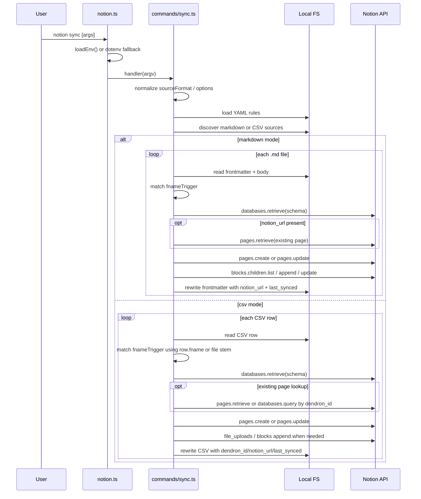

# Notion Sync Command Flow

Last updated: 2026-03-14

## Purpose / Question Answered

This flow doc explains how `notion sync` executes from CLI registration through rule loading, typed source discovery, per-record markdown/CSV handling, and the final Notion create/update write path.
It answers which invocation forms are supported, how the command decides what to sync, and where local state such as `notion_url`, `dendron_id`, and `last_synced` is read or written.

## Entry points

- `scripts/notion/notion.ts`: yargs CLI registration for the `sync` subcommand
- `scripts/notion/commands/sync.ts`: `module.exports.handler` for `sync [target]`
- `scripts/notion/commands/sync.ts`: `syncMarkdownFile` for markdown note records
- `scripts/notion/commands/sync.ts`: `syncCsvFile` for CSV file and row processing
- `scripts/notion/utils/sync.ts`: source-file parsing and wildcard rule matching helpers used by the command

## Call path

### Phase 1: CLI dispatch and invocation normalization

Trigger / entry condition:
- A user invokes `node dist/notion.js sync ...` or the installed `notion sync ...` binary.
- Supported invocation shapes include `sync`, `sync ./notes/file.md`, `sync ./exports/tasks.csv`, `sync --rule task`, `sync --rules-dir ./syncRules`, and `sync --path <dir>`.

Entrypoints:
- `scripts/notion/notion.ts: yargs(...).command(syncCommand).parse()`
- `scripts/notion/commands/sync.ts: handler`

Ordered call path:
- `notion.ts` loads env via `loadEnv()` and falls back to `dotenv.config()` if that lookup throws.
- yargs registers `sync [target]` and dispatches to `sync.ts` when the command name is `sync`.
- `handler` reads `from`, `operation`, `columns`, `limit`, `rule`, `path`, `target`, `dry-run`, and `rules-dir` from argv.
- `handler` rejects the removed `--from` flag and validates `--operation`, `--columns`, and `--limit` as shared sync options.
- `handler` requires `NOTION_TOKEN || NOTION_API_KEY` before any Notion client is created.

State transitions / outputs:
- Input: raw CLI argv and process env
- Output: normalized command options, validated operation mode, authenticated readiness

Branch points:
- If `--from` is passed, the command fails with a removed-flag error.
- If the auth token is absent, the command aborts before reading rules or sources.

External boundaries:
- Local env files through `loadEnv()` in bootstrap

#### Sudocode (Phase 1: CLI dispatch and invocation normalization)

```ts
// Source: scripts/notion/notion.ts
loadEnv
catch -> dotenv.config

yargs(hideBin(process.argv))
  .command(syncCommand)
  .parse()

// Source: scripts/notion/commands/sync.ts
handler(argv)
  if fromArg is provided
    throw Error("--from has been removed...")

  operation := String(operationArg || "sync").trim().toLowerCase()
  validate operation, columnsArg, limitArg

  token := process.env.NOTION_TOKEN || process.env.NOTION_API_KEY
  if !token
    throw Error("NOTION_TOKEN (or NOTION_API_KEY) is required...")
```

### Phase 2: Rule loading, filtering, and source discovery

Trigger / entry condition:
- Phase 1 completed with valid options and token.

Entrypoints:
- `scripts/notion/commands/sync.ts: resolveRulesDir`
- `scripts/notion/commands/sync.ts: loadSyncRules`
- `scripts/notion/commands/sync.ts: resolveNoteRoots`
- `scripts/notion/commands/sync.ts: resolveCsvRoots`
- `scripts/notion/commands/sync.ts: collectSourceFiles`

Ordered call path:
- `handler` resolves the effective rules directory:
  - default `~/.notion-agents-skill/syncRules`
  - or `--rules-dir`
- `loadSyncRules()` verifies the directory exists, loads every `.yaml` / `.yml` file, and normalizes each rule as markdown or CSV.
- Each rule must supply `fnameTrigger`; CSV rules additionally require `mapping[]` and `destination.kind` / `destination.id`, while markdown rules require `destination.databaseId`.
- `handler` applies `--rule` as a filter over the loaded rules by `ruleName` or `name`.
- `discoverSyncSources()` derives the relevant source kinds from the remaining rules.
- Source scope is then resolved from:
  - positional file `target`, whose extension must be `.md` or `.csv`
  - positional directory `target`, which may contain both kinds
  - explicit `--path` roots, which may contain both kinds
  - otherwise the default markdown and CSV roots, with an ambiguity error if both kinds are discoverable
- `collectSourceFiles()` recursively discovers `.md` or `.csv` files under those roots while ignoring `node_modules`, `.git`, and `syncRules`.

State transitions / outputs:
- Input: rules directory, optional `--rule`, optional `target`, optional `--path`
- Output: filtered `rules[]` plus `sourceItems[] = { sourceFormat, filePath }`

Branch points:
- If no YAML files exist in the rules directory, the command errors.
- If `--rule` is provided and leaves no rules, the command errors.
- If `target` is combined with `--path`, the command errors because the command requires exactly one targeting mode.
- If the default run discovers both markdown and CSV files, the command errors and asks for an explicit scope.
- If no matching source files are found, the command prints `No sources found to sync.` and exits `0`.

External boundaries:
- Local filesystem reads for YAML rules and source-file discovery

#### Sudocode (Phase 2: Rule loading, filtering, and source discovery)

```ts
// Source: scripts/notion/commands/sync.ts
rulesDir := resolveRulesDir(rulesDirInput)
allRules := loadSyncRules(rulesDir)

rules := ruleFilter
  ? allRules.filter(r => r.ruleName === ruleFilter || r.name === ruleFilter)
  : allRules

if !rules.length
  throw Error(`No matching sync rules found...`)

sourceItems := discoverSyncSources({ target, extraPaths, rules })

if sourceItems.length === 0
  console.log("No sources found to sync.")
  process.exit(0)
```

### Phase 3: Markdown note routing and record preparation

Trigger / entry condition:
- `sourceFormat === "md"` and at least one markdown file was discovered.

Entrypoints:
- `scripts/notion/commands/sync.ts: parseNoteFile`
- `scripts/notion/commands/sync.ts: getSourceFname`
- `scripts/notion/commands/sync.ts: findMatchingRules`
- `scripts/notion/commands/sync.ts: getDatabaseSchema`
- `scripts/notion/commands/sync.ts: syncMarkdownFile`
- `scripts/notion/utils/sync.ts: parseFrontmatter`
- `scripts/notion/utils/sync.ts: matchFnameTrigger`

Ordered call path:
- For each markdown file, `parseNoteFile()` requires YAML frontmatter and returns `{ data, body }`.
- `getSourceFname(frontmatter, filePath)` uses `frontmatter.fname` when present, otherwise the filename stem.
- `findMatchingRules(sourceRules, noteFname)` matches the note against `fnameTrigger` wildcards.
- The command skips notes with zero matches and fails notes with multiple matches.
- For the single winning rule, `getDatabaseSchema()` retrieves and caches the destination schema.
- If frontmatter already has `notion_url`, the command extracts the page ID and retrieves the existing page.
- `syncMarkdownFile()` reparses the file, then delegates to `syncRecord()` with:
  - `sourceFormat: "md"`
  - `operation: "sync"`
  - markdown body from the note
  - a `persist()` callback that rewrites frontmatter back to the source file

State transitions / outputs:
- Input: markdown file contents, frontmatter, rule match, optional existing `notion_url`
- Output: a fully prepared markdown sync record with schema, body, and persistence callback

Branch points:
- Missing YAML frontmatter is a hard error.
- `fnameTrigger` wildcard matching is the only auto-discovery mechanism for picking the rule.
- A bad `notion_url` that cannot be parsed into a Notion page ID aborts that note.

External boundaries:
- Filesystem reads for note content
- Notion `pages.retrieve` when `notion_url` is already set
- Notion `databases.retrieve` for schema caching

#### Sudocode (Phase 3: Markdown note routing and record preparation)

```ts
// Source: scripts/notion/commands/sync.ts
for filePath in sourceFiles
  parsed := parseNoteFile(filePath) {
    raw := fs.readFileSync(filePath, "utf8")
    parsed := parseFrontmatter(raw) // Source: scripts/notion/utils/sync.ts
    if !parsed.hasFrontmatter
      throw Error("Missing YAML frontmatter.")
  }

  frontmatter := parsed.data || {}
  noteFname := getSourceFname(frontmatter, filePath)
  matchingRules := findMatchingRules(sourceRules, noteFname) {
    return rules.filter(rule => matchFnameTrigger(noteFname, rule.fnameTrigger))
  }

  if matchingRules.length === 0
    summary.skipped += 1
    continue
  if matchingRules.length > 1
    throw Error(`Note matches multiple rules: ...`)

  rule := matchingRules[0]
  schema := getDatabaseSchema(client, schemaCache, rule.destination.databaseId)

  existingPage := null
  if frontmatter.notion_url
    pageId := normalizeNotionId(extractNotionIdFromUrl(frontmatter.notion_url))
    existingPage := client.pages.retrieve({ page_id: pageId })

  syncMarkdownFile(...) {
    parsed := parseNoteFile(filePath)
    frontmatter := parsed.data || {}
    noteBody := parsed.body || ""
    return syncRecord(..., sourceFormat: "md", operation: "sync", body: noteBody, persist: rewrite_frontmatter)
  }
```

### Phase 4: CSV file routing, row-level rule discovery, and payload construction

Trigger / entry condition:
- `sourceFormat === "csv"` and at least one CSV file was discovered.

Entrypoints:
- `scripts/notion/commands/sync.ts: syncCsvFile`
- `scripts/notion/commands/sync.ts: getSourceFname`
- `scripts/notion/commands/sync.ts: findMatchingRules`
- `scripts/notion/commands/sync.ts: getCsvRowSyncId`
- `scripts/notion/commands/sync.ts: buildCsvSyncPayload`
- `scripts/notion/utils/sync.ts: parseCsv`

Ordered call path:
- `syncCsvFile()` parses the CSV, ensures the metadata columns `dendron_id`, `notion_url`, and `last_synced` exist in the file header, and defines `persistCsv()` for rewriting the file.
- For each row:
  - `noteFname := getSourceFname(row, filePath)` uses `row.fname` if present, otherwise the CSV filename stem.
  - `findMatchingRules(rules, noteFname)` auto-discovers the row’s rule using the same `fnameTrigger` wildcard mechanism as markdown.
  - zero matches skip the row; multiple matches are an error.
- For the selected rule:
  - `getDatabaseSchema()` loads the destination database schema.
  - `getCsvRowSyncId()` derives `dendron_id` from `syncIdColumn`, else existing `dendron_id` / `id`, else a stable hash of `ruleName + mapped values`.
  - existing page lookup prefers `notion_url`; otherwise it queries by `dendron_id`.
  - `syncRecord()` is called with `sourceFormat: "csv"` and `operation` equal to `sync` or `update`.
- Inside `buildCsvSyncPayload()`:
  - mapped property values are built field by field
  - `toType: body` fragments accumulate into the page body
  - `toType: file/image` and processor helper file results queue deferred uploads
  - required sync properties `dendron_id` and `last_synced` are injected

State transitions / outputs:
- Input: CSV file, row values, selected mappings, optional `--columns`, optional `--limit`, optional `--operation update`
- Output: per-row sync payload with normalized Notion properties, optional body text, queued file actions, and persisted CSV sync metadata

Branch points:
- `--operation update` changes only the create/update policy; rows without an existing page are skipped instead of created.
- `--columns` narrows which mappings participate, but sync metadata still persists.
- Processor functions can rewrite values, emit body fragments, or enqueue uploads.
- Auto-discovery is per row, not per file, because each row may set its own `fname`.

External boundaries:
- Filesystem reads/writes for CSV
- Optional processor module loads from the rule directory or current workspace
- Notion schema queries and page lookups by `dendron_id` / `notion_url`

#### Sudocode (Phase 4: CSV file routing, row-level rule discovery, and payload construction)

```ts
// Source: scripts/notion/commands/sync.ts
syncCsvFile(filePath, rules, operation, selectedColumns, ...)
  parsed := parseCsvFile(filePath)
  headers := [...parsed.headers]
  rows := parsed.rows || []
  ensure headers contain ["dendron_id", "notion_url", "last_synced"]

  for row in rows
    noteFname := getSourceFname(row, filePath)
    matchingRules := findMatchingRules(rules, noteFname)

    if matchingRules.length === 0
      summary.skipped += 1
      continue
    if matchingRules.length > 1
      throw Error(`Row matches multiple rules: ...`)

    rule := matchingRules[0]
    schema := getDatabaseSchema(client, schemaCache, rule.destination.databaseId)

    syncId := getCsvRowSyncId(row, rule)
    if row.dendron_id !== syncId
      row.dendron_id = syncId

    existingPage := row.notion_url
      ? client.pages.retrieve({ page_id: normalizeNotionId(extractNotionIdFromUrl(row.notion_url)) })
      : findPageByPropertyValue(... propertyName: "dendron_id", value: row.dendron_id)

    syncRecord(..., sourceFormat: "csv", operation, persist: persistCsv)

// Source: scripts/notion/commands/sync.ts
buildCsvSyncPayload(...)
  for mapping in getSyncFieldMappings(rule, row, "csv", selectedColumns)
    processedValue := mapping.processFn ? await mapping.processFn({ column: mapping.fromName, value: rawValue, helper }) : rawValue
    processedItems := mapping.processFn ? combineProcessedOutputs(processedValue, helperContext.queuedFileResults) : flattenProcessorOutput(processedValue)

    for item in processedItems
      if item.__syncKind === "body" || mapping.toType === "body"
        shouldTouchBody = true
        bodyFragments.push(String(item.text ?? item))
      else if item.__syncKind === "file" || mapping.toType === "file/image"
        shouldTouchBody = true
        fileActions.push(...normalizeDeferredFileAction(item, fileContext))
      else
        properties[targetName] = await resolveMappedPropertyValue(...)

  applyRequiredSyncProperties(...)
  return { properties, body, fileActions, shouldTouchBody }
```

### Phase 5: Shared syncRecord create/update path and body persistence

Trigger / entry condition:
- A markdown or CSV record has been matched to exactly one rule and turned into a property/body payload.

Entrypoints:
- `scripts/notion/commands/sync.ts: syncRecord`
- `scripts/notion/commands/sync.ts: replacePageBody`
- `scripts/notion/commands/sync.ts: appendDeferredFileBlocks`

Ordered call path:
- `syncRecord()` stamps `last_synced` in both local-display format and ISO format.
- It chooses payload construction:
  - markdown uses `buildProperties(...)` and reuses the note body directly
  - CSV uses `buildCsvSyncPayload(...)`
- If an existing page URL is missing but an `existingPage` object is already known, `syncRecord()` backfills `sourceData.notion_url`.
- Create branch:
  - if no `notion_url` and `operation !== "update"`, ensure the title property exists
  - in dry-run mode, return `would_create`
  - otherwise call `client.pages.create()`
  - append paragraph blocks for the body
  - append deferred file/image blocks
  - persist the source file with `notion_url` and `last_synced`
- Update branch:
  - derive `pageId` from `existingPage.id` or `notion_url`
  - in dry-run mode, return `would_update`
  - otherwise call `client.pages.update()` for properties
  - if `shouldTouchBody`, call `replacePageBody()` and then append file/image blocks
  - persist the source file
- `replacePageBody()` archives all existing child blocks except toggles labeled `NOTION_ONLY`, then appends new paragraph blocks in chunks.

State transitions / outputs:
- Input: normalized sync payload plus optional existing page identity
- Output: Notion page created, updated, skipped, or dry-run simulated; source file/CSV rewritten with sync markers

Branch points:
- `operation === "update"` with no existing page returns `skipped_update` / `would_skip_update` instead of creating a page.
- `dryRun` returns simulated actions and suppresses remote writes.
- CSV body replacement is conditional on `shouldTouchBody`; markdown updates always touch the body path because the note body is canonical.
- Invalid `notion_url` blocks updates even if the local source otherwise matches a rule.

External boundaries:
- Notion `pages.create`, `pages.update`, `pages.retrieve`
- Notion `blocks.children.list`, `blocks.children.append`, `blocks.update`
- Notion file upload REST API for local file attachments
- Filesystem writes through `persist()` / `persistCsv()`

#### Sudocode (Phase 5: Shared syncRecord create/update path and body persistence)

```ts
// Source: scripts/notion/commands/sync.ts
syncRecord(...)
  syncTimestamp := new Date
  lastSyncedFrontmatter := formatLocalDateTime(syncTimestamp)
  lastSyncedIso := syncTimestamp.toISOString()

  syncPayload := sourceFormat === "csv"
    ? await buildCsvSyncPayload(...)
    : { properties: await buildProperties(...), body, fileActions }

  sourceData.last_synced = lastSyncedFrontmatter
  if !sourceData.notion_url && existingPage?.url
    sourceData.notion_url = existingPage.url

  if !sourceData.notion_url
    if operation === "update"
      if !dryRun && persist
        persist
      return skipped_update

    ensureTitleProperty({ properties, schema })
    if dryRun
      return would_create

    created := client.pages.create({ parent: { database_id: rule.destination.databaseId }, properties })
    appendBlocksInChunks(client, created.id, markdownToParagraphBlocks(effectiveBody))
    appendDeferredFileBlocks(client, created.id, effectiveFileActions, authToken)
    sourceData.notion_url = created.url
    persist
    return created

  pageId := existingPage ? existingPage.id : normalizeNotionId(extractNotionIdFromUrl(sourceData.notion_url))
  if !pageId
    throw Error("Unable to extract page ID from notion_url.")

  if dryRun
    return would_update

  client.pages.update({ page_id: pageId, properties })

  if shouldTouchBody
    replacePageBody({ client, pageId, body: effectiveBody }) {
      existingBlocks := listAllBlockChildren(client, pageId)
      blocksToArchive := existingBlocks.filter(block => !isNotionOnlyToggle(block))
      archiveBlocks(client, blocksToArchive)
      appendBlocksInChunks(client, pageId, markdownToParagraphBlocks(body))
    }
    appendDeferredFileBlocks(client, pageId, effectiveFileActions, authToken)

  persist
  return updated
```

## State, config, and gates

### Core state values (source of truth and usage)

- `sourceItems`
  - Source: `discoverSyncSources()` after rule filtering, target/path resolution, and extension inference
  - Consumed by: the unified file-processing loop that dispatches markdown files vs CSV files
  - Risk area: default runs error when both markdown and CSV are discoverable without explicit scope

- `rules`
  - Source: YAML files under the resolved rules directory
  - Consumed by: markdown note matching and CSV row matching
  - Risk area: mis-specified `fnameTrigger` causes silent skips or ambiguity errors

- `notion_url`
  - Source: markdown frontmatter or CSV metadata column, later backfilled from create/update results
  - Consumed by: existing page lookup and update target resolution
  - Risk area: malformed URLs block update paths

- `dendron_id`
  - Source: CSV row `syncIdColumn`, existing `dendron_id` / `id`, or generated stable hash
  - Consumed by: CSV lookup of existing Notion pages and destination sync invariants
  - Risk area: changing mapped fields can change the generated fallback hash

- `last_synced`
  - Source: generated inside `syncRecord()`
  - Consumed by: local source-file persistence and required destination Notion properties
  - Risk area: markdown stores local display time while Notion receives ISO date/time input

- `shouldTouchBody`
  - Source: derived in `buildCsvSyncPayload()` for CSV, always true for markdown updates
  - Consumed by: update branch body replacement and deferred upload append
  - Risk area: CSV updates that only touch properties intentionally skip body replacement

### Statsig (or `None identified`)

None identified

### Environment Variables (or `None identified`)

| Name | Where Read | Default | Effect on Flow |
|---|---|---|---|
| `NOTION_TOKEN` | `scripts/notion/commands/sync.ts` and bootstrap via `scripts/notion/notion.ts` | None | Required auth token for all Notion reads/writes |
| `NOTION_API_KEY` | `scripts/notion/commands/sync.ts` and bootstrap via `scripts/notion/notion.ts` | None | Alias fallback for auth token |
| `NODE_ENV` | `scripts/notion/commands/sync.ts` and env loading in `scripts/notion/utils/helpers.ts` | `production` semantics when unset | Selects `test` vs `production` cache/env behavior for related helpers |

### Other User-Settable Inputs (or `None identified`)

| Name | Type | Where Read | Effect on Flow |
|---|---|---|---|
| `target` | positional path | `scripts/notion/commands/sync.ts` | Restricts the run to one file or directory |
| `--path` | repeated path option | `scripts/notion/commands/sync.ts` | Adds extra roots to scan for markdown/CSV sources |
| `--rule` | string option | `scripts/notion/commands/sync.ts` | Narrows loaded rules to one named rule before source matching |
| `--rules-dir` | path option | `scripts/notion/commands/sync.ts` | Overrides the default home-scoped sync rules directory |
| `--operation` | enum option | `scripts/notion/commands/sync.ts` | Switches between create-or-update and update-only behavior for both markdown and CSV records |
| `--columns` | repeated string option | `scripts/notion/commands/sync.ts` | Limits which markdown `fmToSync` entries or CSV mappings participate in payload construction |
| `--limit` | number option | `scripts/notion/commands/sync.ts` | Caps processed records across markdown files and CSV rows together |
| `--dry-run` | boolean option | `scripts/notion/commands/sync.ts` | Simulates actions without remote writes |
| `row.fname` / frontmatter `fname` | source data field | `scripts/notion/commands/sync.ts` | Overrides filename-stem-based rule auto-discovery |

### Important gates / branch controls

- `sourceItem.sourceFormat === "csv"`: switches the current file into CSV row iteration and CSV payload building.
- `target` vs `--path`: the command forbids mixing a positional target with `--path`.
- `matchingRules.length`: zero matches skip; more than one match errors; exactly one match proceeds.
- `operation === "update"`: prevents creation of new markdown pages and new CSV pages.
- `dryRun`: suppresses remote writes and returns `would_*` actions.
- `shouldTouchBody`: controls whether CSV updates replace the remote page body.
- `isNotionOnlyToggle(block)`: preserves toggle blocks labeled `NOTION_ONLY` when replacing page content.

## Sequence diagram



## Observability

Metrics:
- None identified in the current implementation

Logs:
- Per-record success lines in `sync.ts` using `console.log`, including `created`, `updated`, and dry-run actions
- Per-record failure lines in `sync.ts` using `console.error`
- Final summary/failure exit reporting in `sync.ts`

Useful debug checkpoints:
- After `sourceFormat` is chosen and option validation passes
- After `loadSyncRules()` returns and `sourceRules` is filtered
- After `matchingRules` is computed for a given markdown note or CSV row
- Before `syncRecord()` when `existingPage`, `dendron_id`, and destination schema are known
- Inside `replacePageBody()` when `NOTION_ONLY` preservation matters

## Related docs

- `docs/architecture/2026-03-14-architecture-notion-cli.md`
- `scripts/notion/docs/specs/active/2026-01-31-notion-sync-command.md`
- `scripts/notion/docs/specs/active/2026-02-01-notion-sync-integration-tests.md`
- `scripts/notion/USAGE.md`

## Manual Notes 

[keep this for the user to add notes. do not change between edits]

## Changelog
- 2026-03-14: Created flow doc for the `notion sync` command covering CLI entry, markdown path, CSV path, and shared write behavior. (019ced21-416c-79c1-99c2-56a569735cc6)
